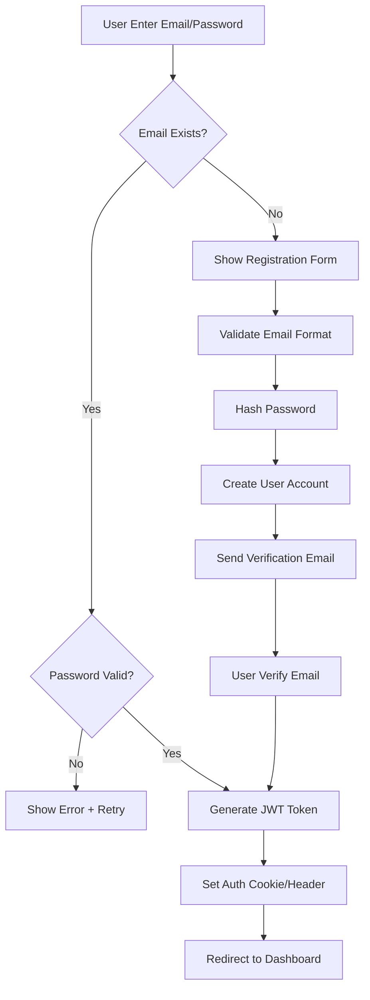
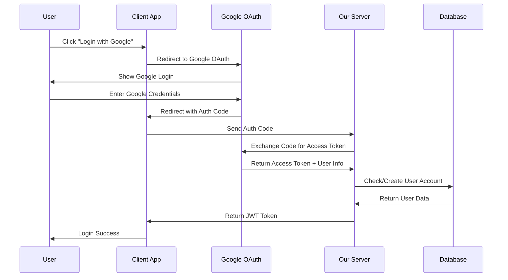

# AUTHENTICATION SYSTEM ANALYSIS
## URL Shortening Platform - Login & Security Strategy

---

## 📋 EXECUTIVE SUMMARY

Phân tích thiết kế hệ thống authentication cho nền tảng ShortLink, bao gồm multiple login methods, account linking strategies, và JWT evolution từ stateless sang stateful nhằm cân bằng giữa performance và security.

**Key Authentication Methods:**
- ✅ Email/Password (Traditional)
- ✅ Google OAuth 2.0 (Social Login)
- ✅ GitHub OAuth 2.0 (Developer-focused)
- ✅ Account Linking & Merging

**Security Evolution:**
- 🚀 **Phase 1**: JWT Stateless (MVP Launch)
- 🔒 **Phase 2**: JWT Stateful (Production Scale)

---

## 🔐 AUTHENTICATION METHODS ANALYSIS

### 📧 **Method 1: Email/Password Authentication**

#### **User Flow:**


#### **Implementation Details:**
```javascript
// Registration Flow
const registerUser = async (email, password, name) => {
  // 1. Validation
  if (!isValidEmail(email)) throw new Error('Invalid email format');
  if (password.length < 8) throw new Error('Password too short');
  
  // 2. Check existing user
  const existingUser = await User.findOne({ email });
  if (existingUser) throw new Error('Email already registered');
  
  // 3. Hash password
  const saltRounds = 12;
  const hashedPassword = await bcrypt.hash(password, saltRounds);
  
  // 4. Create user
  const user = await User.create({
    email,
    password: hashedPassword,
    name,
    provider: 'email',
    emailVerified: false,
    createdAt: new Date()
  });
  
  // 5. Send verification email
  await sendVerificationEmail(user.email, user.id);
  
  return { success: true, userId: user.id };
};
```

#### **Security Features:**
```yaml
Password Security:
  - Minimum 8 characters
  - bcrypt hashing (salt rounds: 12)
  - Password strength validation
  - Rate limiting (5 attempts/15min)
  
Email Security:
  - Email format validation
  - Domain verification
  - Email verification required
  - Disposable email detection
  
Brute Force Protection:
  - Account lockout after 5 failed attempts
  - Progressive delay (1s, 2s, 4s, 8s, 16s)
  - IP-based rate limiting
  - CAPTCHA after 3 attempts
```

### 🔵 **Method 2: Google OAuth 2.0**

#### **OAuth Flow:**


#### **Implementation:**
```javascript
// Google OAuth Handler
const handleGoogleAuth = async (authCode) => {
  // 1. Exchange code for tokens
  const tokenResponse = await axios.post('https://oauth2.googleapis.com/token', {
    client_id: process.env.GOOGLE_CLIENT_ID,
    client_secret: process.env.GOOGLE_CLIENT_SECRET,
    code: authCode,
    grant_type: 'authorization_code',
    redirect_uri: process.env.GOOGLE_REDIRECT_URI
  });
  
  const { access_token, id_token } = tokenResponse.data;
  
  // 2. Verify and decode ID token
  const userInfo = jwt.decode(id_token);
  const { sub: googleId, email, name, picture } = userInfo;
  
  // 3. Find or create user
  let user = await User.findOne({ 
    $or: [
      { googleId },
      { email, emailVerified: true }
    ]
  });
  
  if (!user) {
    // Create new user
    user = await User.create({
      googleId,
      email,
      name,
      avatar: picture,
      provider: 'google',
      emailVerified: true,
      createdAt: new Date()
    });
  } else if (!user.googleId) {
    // Link existing email account with Google
    user.googleId = googleId;
    user.linkedAccounts.push({
      provider: 'google',
      linkedAt: new Date()
    });
    await user.save();
  }
  
  return generateJWT(user);
};
```

### 🐙 **Method 3: GitHub OAuth 2.0**

#### **GitHub OAuth Flow:**
```javascript
// GitHub OAuth Configuration
const githubOAuthConfig = {
  client_id: process.env.GITHUB_CLIENT_ID,
  scope: 'user:email',
  redirect_uri: `${process.env.BASE_URL}/auth/github/callback`,
  state: generateRandomState() // CSRF protection
};

// GitHub Auth Handler
const handleGitHubAuth = async (authCode, state) => {
  // 1. Verify state parameter
  if (!verifyState(state)) throw new Error('Invalid state parameter');
  
  // 2. Exchange code for access token
  const tokenResponse = await axios.post('https://github.com/login/oauth/access_token', {
    client_id: process.env.GITHUB_CLIENT_ID,
    client_secret: process.env.GITHUB_CLIENT_SECRET,
    code: authCode,
    state
  }, {
    headers: { 'Accept': 'application/json' }
  });
  
  const { access_token } = tokenResponse.data;
  
  // 3. Get user info
  const [userResponse, emailsResponse] = await Promise.all([
    axios.get('https://api.github.com/user', {
      headers: { 'Authorization': `Bearer ${access_token}` }
    }),
    axios.get('https://api.github.com/user/emails', {
      headers: { 'Authorization': `Bearer ${access_token}` }
    })
  ]);
  
  const userInfo = userResponse.data;
  const primaryEmail = emailsResponse.data.find(email => email.primary)?.email;
  
  // 4. Find or create user
  let user = await User.findOne({
    $or: [
      { githubId: userInfo.id },
      { email: primaryEmail, emailVerified: true }
    ]
  });
  
  if (!user) {
    user = await User.create({
      githubId: userInfo.id,
      email: primaryEmail,
      name: userInfo.name || userInfo.login,
      username: userInfo.login,
      avatar: userInfo.avatar_url,
      provider: 'github',
      emailVerified: true,
      createdAt: new Date()
    });
  }
  
  return generateJWT(user);
};
```

---

## 🔗 ACCOUNT LINKING STRATEGY

### 🤔 **Scenario: Email/Password User Links Google Account**

#### **Problem Statement:**
User đăng ký với `user@gmail.com` + password, sau đó muốn login bằng Google với cùng email `user@gmail.com`.

#### **Solution Approach:**

**Option 1: Automatic Linking (Recommended)**
```javascript
const linkGoogleAccount = async (googleUserInfo, existingUser) => {
  // Verify email matches
  if (existingUser.email !== googleUserInfo.email) {
    throw new Error('Email mismatch. Cannot link accounts.');
  }
  
  // Verify email is verified
  if (!existingUser.emailVerified) {
    throw new Error('Please verify your email first before linking accounts.');
  }
  
  // Link accounts
  existingUser.googleId = googleUserInfo.sub;
  existingUser.linkedAccounts.push({
    provider: 'google',
    providerId: googleUserInfo.sub,
    linkedAt: new Date(),
    method: 'automatic' // vs 'manual'
  });
  
  // Update user info from Google (optional)
  if (!existingUser.avatar && googleUserInfo.picture) {
    existingUser.avatar = googleUserInfo.picture;
  }
  
  await existingUser.save();
  
  return { 
    success: true, 
    message: 'Google account linked successfully',
    user: existingUser 
  };
};
```

**Option 2: Manual Linking with Confirmation**
```javascript
const initiateAccountLinking = async (userId, provider, providerData) => {
  // Create temporary linking token
  const linkingToken = generateSecureToken();
  
  await LinkingRequest.create({
    userId,
    provider,
    providerData: encryptProviderData(providerData),
    token: linkingToken,
    expiresAt: new Date(Date.now() + 15 * 60 * 1000) // 15 minutes
  });
  
  // Send confirmation email
  await sendAccountLinkingEmail(user.email, linkingToken);
  
  return { 
    success: true, 
    message: 'Linking confirmation sent to your email' 
  };
};

const confirmAccountLinking = async (token, userId) => {
  const linkingRequest = await LinkingRequest.findOne({
    token,
    userId,
    expiresAt: { $gt: new Date() },
    used: false
  });
  
  if (!linkingRequest) {
    throw new Error('Invalid or expired linking token');
  }
  
  // Link accounts
  const user = await User.findById(userId);
  const providerData = decryptProviderData(linkingRequest.providerData);
  
  user[`${linkingRequest.provider}Id`] = providerData.id;
  user.linkedAccounts.push({
    provider: linkingRequest.provider,
    providerId: providerData.id,
    linkedAt: new Date(),
    method: 'manual'
  });
  
  await user.save();
  
  // Mark linking request as used
  linkingRequest.used = true;
  await linkingRequest.save();
  
  return { success: true };
};
```

#### **User Experience Flow:**
```mermaid
graph TD
    A[User clicks "Login with Google"] --> B{Email exists in system?}
    B -->|No| C[Create new Google account]
    B -->|Yes| D{Same email as Google?}
    D -->|No| E[Show error: Email mismatch]
    D -->|Yes| F{Email verified?}
    F -->|No| G[Require email verification first]
    F -->|Yes| H[Show linking confirmation]
    H --> I{User confirms?}
    I -->|No| J[Cancel linking]
    I -->|Yes| K[Link accounts automatically]
    K --> L[Login successful with merged account]
    
    C --> M[Complete Google OAuth]
    M --> L
```

### 📊 **Account Data Merging Strategy**

#### **Data Merge Priority:**
```javascript
const mergeAccountData = (primaryAccount, linkedAccount) => {
  const merged = { ...primaryAccount };
  
  // Priority rules for conflicting data
  const mergeRules = {
    avatar: linkedAccount.avatar || primaryAccount.avatar,
    name: primaryAccount.name || linkedAccount.name, // Keep original name
    email: primaryAccount.email, // Always keep primary email
    username: primaryAccount.username || linkedAccount.username,
    
    // Merge arrays
    linkedAccounts: [
      ...primaryAccount.linkedAccounts,
      {
        provider: linkedAccount.provider,
        providerId: linkedAccount.providerId,
        linkedAt: new Date()
      }
    ],
    
    // Keep subscription data from primary
    subscription: primaryAccount.subscription,
    usage: primaryAccount.usage,
    
    // Update timestamps
    lastLoginAt: new Date(),
    updatedAt: new Date()
  };
  
  return { ...merged, ...mergeRules };
};
```

#### **Duplicate Account Prevention:**
```javascript
const preventDuplicateAccounts = async (providerData) => {
  const { email, provider, providerId } = providerData;
  
  // Check for existing accounts
  const existingAccounts = await User.find({
    $or: [
      { email, emailVerified: true },
      { [`${provider}Id`]: providerId }
    ]
  });
  
  if (existingAccounts.length > 1) {
    // Multiple accounts found - require manual resolution
    return {
      action: 'manual_merge',
      accounts: existingAccounts,
      message: 'Multiple accounts found. Please choose which to keep.'
    };
  } else if (existingAccounts.length === 1) {
    // Single account - auto-link if email matches
    return {
      action: 'auto_link',
      account: existingAccounts[0]
    };
  } else {
    // No existing account - create new
    return {
      action: 'create_new'
    };
  }
};
```

---

## 🔑 JWT STRATEGY EVOLUTION

### 🚀 **Phase 1: JWT Stateless (MVP Launch)**

#### **Why Start Stateless:**
```yaml
Advantages:
  - Simple implementation
  - No server-side session storage
  - Horizontal scaling friendly  
  - Reduced database queries
  - Faster authentication checks
  
Use Cases:
  - MVP development speed
  - Small user base (<10K users)
  - Simple feature set
  - Limited security requirements
```

#### **Stateless JWT Implementation:**
```javascript
// JWT Generation (Stateless)
const generateStatelessJWT = (user) => {
  const payload = {
    userId: user.id,
    email: user.email,
    role: user.role,
    subscription: user.subscription?.tier || 'free',
    exp: Math.floor(Date.now() / 1000) + (7 * 24 * 60 * 60), // 7 days
    iat: Math.floor(Date.now() / 1000),
    iss: 'shortlink.io',
    aud: 'shortlink-api'
  };
  
  return jwt.sign(payload, process.env.JWT_SECRET, {
    algorithm: 'HS256'
  });
};

// JWT Verification Middleware
const verifyStatelessJWT = async (req, res, next) => {
  try {
    const token = extractTokenFromHeader(req.headers.authorization);
    const decoded = jwt.verify(token, process.env.JWT_SECRET);
    
    // No database lookup required
    req.user = decoded;
    next();
  } catch (error) {
    return res.status(401).json({ error: 'Invalid token' });
  }
};

// Token Refresh (Stateless)
const refreshStatelessToken = async (req, res) => {
  const { refreshToken } = req.body;
  
  try {
    // Verify refresh token
    const decoded = jwt.verify(refreshToken, process.env.REFRESH_TOKEN_SECRET);
    
    // Get updated user info
    const user = await User.findById(decoded.userId);
    if (!user || !user.isActive) {
      throw new Error('User not found or inactive');
    }
    
    // Generate new access token
    const newAccessToken = generateStatelessJWT(user);
    
    res.json({ 
      accessToken: newAccessToken,
      expiresIn: 7 * 24 * 60 * 60 
    });
  } catch (error) {
    res.status(401).json({ error: 'Invalid refresh token' });
  }
};
```

#### **Stateless Limitations:**
```yaml
Security Concerns:
  - Cannot revoke tokens before expiry
  - No real-time permission updates
  - Token stealing risk (XSS/CSRF)
  - No session invalidation on logout
  
Scalability Issues:
  - User data in token becomes outdated
  - Large token size with more claims
  - No centralized session management
```

### 🔒 **Phase 2: JWT Stateful (Production Scale)**

#### **When to Migrate:**
```yaml
Triggers:
  - User base > 50K active users
  - Enterprise customers onboard
  - Security audit requirements
  - Real-time permission changes needed
  - Token revocation requirements
  
Timeline: Month 12-18 post-launch
```

#### **Stateful JWT Implementation:**
```javascript
// Session Storage Schema
const SessionSchema = {
  sessionId: String,        // Unique session identifier
  userId: ObjectId,         // Reference to user
  deviceId: String,         // Device fingerprint
  jti: String,             // JWT ID (from token)
  isActive: Boolean,        // Session status
  createdAt: Date,          // Session creation
  lastAccessAt: Date,       // Last activity
  expiresAt: Date,          // Session expiry
  ipAddress: String,        // Client IP
  userAgent: String,        // Client info
  revokedAt: Date,          // Manual revocation
  revokedReason: String     // Revocation reason
};

// JWT Generation (Stateful)
const generateStatefulJWT = async (user, deviceInfo) => {
  // Create session record
  const session = await Session.create({
    sessionId: uuidv4(),
    userId: user.id,
    deviceId: generateDeviceFingerprint(deviceInfo),
    isActive: true,
    createdAt: new Date(),
    lastAccessAt: new Date(),
    expiresAt: new Date(Date.now() + 7 * 24 * 60 * 60 * 1000),
    ipAddress: deviceInfo.ip,
    userAgent: deviceInfo.userAgent
  });
  
  const payload = {
    userId: user.id,
    sessionId: session.sessionId,
    jti: uuidv4(), // JWT ID for revocation
    exp: Math.floor(Date.now() / 1000) + (60 * 60), // 1 hour (shorter)
    iat: Math.floor(Date.now() / 1000)
  };
  
  return {
    accessToken: jwt.sign(payload, process.env.JWT_SECRET),
    sessionId: session.sessionId
  };
};

// JWT Verification (Stateful)
const verifyStatefulJWT = async (req, res, next) => {
  try {
    const token = extractTokenFromHeader(req.headers.authorization);
    const decoded = jwt.verify(token, process.env.JWT_SECRET);
    
    // Verify session exists and is active
    const session = await Session.findOne({
      sessionId: decoded.sessionId,
      isActive: true,
      expiresAt: { $gt: new Date() }
    }).populate('userId');
    
    if (!session) {
      throw new Error('Session expired or invalid');
    }
    
    // Update last access time
    session.lastAccessAt = new Date();
    await session.save();
    
    // Attach fresh user data
    req.user = session.userId;
    req.session = session;
    
    next();
  } catch (error) {
    return res.status(401).json({ error: 'Invalid or expired token' });
  }
};

// Session Management
const revokeSession = async (sessionId, reason = 'user_logout') => {
  await Session.updateOne(
    { sessionId },
    { 
      isActive: false,
      revokedAt: new Date(),
      revokedReason: reason
    }
  );
};

const revokeAllUserSessions = async (userId, except = null) => {
  const filter = { userId, isActive: true };
  if (except) filter.sessionId = { $ne: except };
  
  await Session.updateMany(filter, {
    isActive: false,
    revokedAt: new Date(),
    revokedReason: 'security_revocation'
  });
};
```

#### **Advanced Security Features:**
```javascript
// Concurrent Session Limiting
const limitConcurrentSessions = async (userId, maxSessions = 5) => {
  const activeSessions = await Session.find({
    userId,
    isActive: true,
    expiresAt: { $gt: new Date() }
  }).sort({ lastAccessAt: -1 });
  
  if (activeSessions.length >= maxSessions) {
    // Revoke oldest sessions
    const sessionsToRevoke = activeSessions.slice(maxSessions - 1);
    await Session.updateMany(
      { sessionId: { $in: sessionsToRevoke.map(s => s.sessionId) } },
      { 
        isActive: false,
        revokedAt: new Date(),
        revokedReason: 'concurrent_limit_exceeded'
      }
    );
  }
};

// Suspicious Activity Detection
const detectSuspiciousActivity = async (session, currentRequest) => {
  const suspiciousFactors = [];
  
  // Different IP address
  if (session.ipAddress !== currentRequest.ip) {
    suspiciousFactors.push('ip_change');
  }
  
  // Different user agent
  if (session.userAgent !== currentRequest.userAgent) {
    suspiciousFactors.push('user_agent_change');
  }
  
  // Geographic distance
  const distance = calculateDistance(session.lastLocation, currentRequest.location);
  if (distance > 1000) { // 1000km threshold
    suspiciousFactors.push('impossible_travel');
  }
  
  if (suspiciousFactors.length >= 2) {
    // Require re-authentication
    await revokeSession(session.sessionId, 'suspicious_activity');
    throw new Error('Suspicious activity detected. Please log in again.');
  }
};
```

### 🔄 **Migration Strategy: Stateless → Stateful**

#### **Gradual Migration Plan:**
```yaml
Phase 2.1 (Month 12): Infrastructure Setup
  - Deploy session storage (Redis/MongoDB)
  - Implement session management API
  - Add session tracking to new logins
  - Maintain backward compatibility

Phase 2.2 (Month 13): Dual Mode Operation  
  - Support both stateless and stateful tokens
  - Migrate active users gradually
  - Monitor performance impact
  - A/B test security improvements

Phase 2.3 (Month 14): Full Migration
  - Force token refresh for all users
  - Deprecate stateless token support
  - Enable advanced security features
  - Monitor and optimize performance
```

#### **Migration Implementation:**
```javascript
// Dual Mode JWT Verification
const verifyJWT = async (req, res, next) => {
  try {
    const token = extractTokenFromHeader(req.headers.authorization);
    const decoded = jwt.verify(token, process.env.JWT_SECRET);
    
    if (decoded.sessionId) {
      // Stateful token - verify session
      return await verifyStatefulJWT(req, res, next);
    } else {
      // Stateless token - legacy support
      req.user = decoded; // Add migration flag
      req.user.migrationRequired = true;
      return next();
    }
  } catch (error) {
    return res.status(401).json({ error: 'Invalid token' });
  }
};

// Force migration middleware
const requireMigration = async (req, res, next) => {
  if (req.user.migrationRequired) {
    return res.status(426).json({
      error: 'Token migration required',
      action: 'refresh_token',
      endpoint: '/auth/migrate-token'
    });
  }
  next();
};
```

---

## 🛡️ SECURITY CONSIDERATIONS

### 🔒 **Token Security Best Practices**

#### **Storage Security:**
```javascript
// Secure Token Storage Options
const tokenStorageStrategies = {
  // Option 1: HttpOnly Cookies (Recommended)
  httpOnlyCookies: {
    secure: true,           // HTTPS only
    httpOnly: true,         // No JavaScript access
    sameSite: 'strict',     // CSRF protection
    maxAge: 7 * 24 * 60 * 60 * 1000 // 7 days
  },
  
  // Option 2: Local Storage (with XSS protection)
  localStorage: {
    advantages: ['Persists across tabs', 'Easy implementation'],
    disadvantages: ['XSS vulnerable', 'No automatic expiry'],
    mitigation: ['Content Security Policy', 'XSS protection headers']
  },
  
  // Option 3: Memory Storage (Most secure)
  memoryStorage: {
    advantages: ['XSS immune', 'Auto-cleanup on close'],
    disadvantages: ['Lost on refresh', 'Poor UX'],
    useCase: 'Highly sensitive applications'
  }
};
```

#### **CSRF Protection:**
```javascript
// CSRF Token Implementation
const generateCSRFToken = (sessionId) => {
  return jwt.sign(
    { sessionId, purpose: 'csrf' },
    process.env.CSRF_SECRET,
    { expiresIn: '1h' }
  );
};

const verifyCSRFToken = (req, res, next) => {
  if (['POST', 'PUT', 'DELETE', 'PATCH'].includes(req.method)) {
    const csrfToken = req.headers['x-csrf-token'] || req.body._csrf;
    
    if (!csrfToken) {
      return res.status(403).json({ error: 'CSRF token required' });
    }
    
    try {
      const decoded = jwt.verify(csrfToken, process.env.CSRF_SECRET);
      if (decoded.sessionId !== req.session.sessionId) {
        throw new Error('CSRF token mismatch');
      }
    } catch (error) {
      return res.status(403).json({ error: 'Invalid CSRF token' });
    }
  }
  
  next();
};
```

### 🚨 **Advanced Security Features**

#### **Anomaly Detection:**
```javascript
const SecurityMonitor = {
  // Track login patterns
  trackLoginPattern: async (userId, deviceInfo) => {
    const recentLogins = await LoginAttempt.find({
      userId,
      createdAt: { $gte: new Date(Date.now() - 24 * 60 * 60 * 1000) }
    });
    
    const anomalies = [];
    
    // Check for unusual locations
    const locations = recentLogins.map(l => l.location);
    if (hasUnusualLocation(locations, deviceInfo.location)) {
      anomalies.push('unusual_location');
    }
    
    // Check for unusual times
    const times = recentLogins.map(l => l.createdAt.getHours());
    if (hasUnusualTiming(times, new Date().getHours())) {
      anomalies.push('unusual_timing');
    }
    
    // Check for multiple devices
    const devices = recentLogins.map(l => l.deviceFingerprint);
    if (hasTooManyDevices(devices)) {
      anomalies.push('multiple_devices');
    }
    
    return anomalies;
  },
  
  // Risk scoring
  calculateRiskScore: (anomalies, userProfile) => {
    let score = 0;
    
    anomalies.forEach(anomaly => {
      switch (anomaly) {
        case 'unusual_location': score += 30; break;
        case 'unusual_timing': score += 10; break;
        case 'multiple_devices': score += 20; break;
        case 'impossible_travel': score += 50; break;
      }
    });
    
    // Adjust based on user profile
    if (userProfile.subscription === 'enterprise') score *= 1.5;
    if (userProfile.hasAdminRights) score *= 2;
    
    return Math.min(score, 100);
  },
  
  // Response actions
  handleRiskScore: async (score, userId, sessionId) => {
    if (score >= 70) {
      // High risk - block and require verification
      await revokeAllUserSessions(userId);
      await sendSecurityAlert(userId, 'account_compromised_suspected');
      return 'account_locked';
    } else if (score >= 40) {
      // Medium risk - require 2FA
      return 'require_2fa';
    } else if (score >= 20) {
      // Low risk - log and monitor
      await logSecurityEvent(userId, 'suspicious_activity', score);
      return 'monitor';
    }
    
    return 'allow';
  }
};
```

#### **Device Management:**
```javascript
const DeviceManager = {
  // Generate device fingerprint
  generateFingerprint: (request) => {
    const components = [
      request.headers['user-agent'],
      request.headers['accept-language'],
      request.headers['accept-encoding'],
      request.ip,
      // Screen resolution (from client)
      request.body.screenResolution,
      // Timezone (from client)  
      request.body.timezone
    ];
    
    return crypto
      .createHash('sha256')
      .update(components.join('|'))
      .digest('hex');
  },
  
  // Track trusted devices
  registerTrustedDevice: async (userId, deviceFingerprint, deviceInfo) => {
    const existingDevice = await TrustedDevice.findOne({
      userId,
      fingerprint: deviceFingerprint
    });
    
    if (!existingDevice) {
      await TrustedDevice.create({
        userId,
        fingerprint: deviceFingerprint,
        name: deviceInfo.name || 'Unknown Device',
        type: deviceInfo.type || 'Unknown',
        os: deviceInfo.os,
        browser: deviceInfo.browser,
        firstSeen: new Date(),
        lastSeen: new Date(),
        isTrusted: false // Requires user confirmation
      });
      
      // Notify user of new device
      await sendNewDeviceNotification(userId, deviceInfo);
    } else {
      // Update last seen
      existingDevice.lastSeen = new Date();
      await existingDevice.save();
    }
  }
};
```

---

## 📊 PERFORMANCE CONSIDERATIONS

### ⚡ **Authentication Performance Optimization**

#### **Caching Strategy:**
```javascript
// Redis caching for session data
const SessionCache = {
  // Cache active sessions
  cacheSession: async (sessionId, sessionData, ttl = 3600) => {
    await redis.setex(
      `session:${sessionId}`, 
      ttl, 
      JSON.stringify(sessionData)
    );
  },
  
  // Get cached session
  getCachedSession: async (sessionId) => {
    const cached = await redis.get(`session:${sessionId}`);
    return cached ? JSON.parse(cached) : null;
  },
  
  // Invalidate session cache
  invalidateSession: async (sessionId) => {
    await redis.del(`session:${sessionId}`);
  },
  
  // Batch invalidation for user
  invalidateUserSessions: async (userId) => {
    const pattern = `session:user:${userId}:*`;
    const keys = await redis.keys(pattern);
    if (keys.length > 0) {
      await redis.del(...keys);
    }
  }
};

// Optimized JWT verification with caching
const verifyJWTWithCache = async (req, res, next) => {
  try {
    const token = extractTokenFromHeader(req.headers.authorization);
    const decoded = jwt.verify(token, process.env.JWT_SECRET);
    
    // Try cache first
    let sessionData = await SessionCache.getCachedSession(decoded.sessionId);
    
    if (!sessionData) {
      // Cache miss - query database
      const session = await Session.findOne({
        sessionId: decoded.sessionId,
        isActive: true
      }).populate('userId');
      
      if (!session) {
        throw new Error('Session not found');
      }
      
      sessionData = {
        userId: session.userId.id,
        user: session.userId,
        sessionId: session.sessionId,
        lastAccessAt: session.lastAccessAt
      };
      
      // Cache for next request
      await SessionCache.cacheSession(decoded.sessionId, sessionData);
    }
    
    req.user = sessionData.user;
    req.session = { sessionId: sessionData.sessionId };
    
    next();
  } catch (error) {
    return res.status(401).json({ error: 'Invalid token' });
  }
};
```

#### **Database Optimization:**
```javascript
// Optimized session cleanup
const cleanupExpiredSessions = async () => {
  const batchSize = 1000;
  let processed = 0;
  
  while (true) {
    const expiredSessions = await Session.find({
      $or: [
        { expiresAt: { $lt: new Date() } },
        { isActive: false, revokedAt: { $lt: new Date(Date.now() - 30 * 24 * 60 * 60 * 1000) } }
      ]
    }).limit(batchSize);
    
    if (expiredSessions.length === 0) break;
    
    // Batch delete
    const sessionIds = expiredSessions.map(s => s.sessionId);
    await Session.deleteMany({ sessionId: { $in: sessionIds } });
    
    // Clear cache
    await Promise.all(
      sessionIds.map(id => SessionCache.invalidateSession(id))
    );
    
    processed += expiredSessions.length;
  }
  
  console.log(`Cleaned up ${processed} expired sessions`);
};

// Database indexes for performance
const createAuthIndexes = async () => {
  // User indexes
  await User.createIndex({ email: 1 }, { unique: true });
  await User.createIndex({ googleId: 1 }, { sparse: true });
  await User.createIndex({ githubId: 1 }, { sparse: true });
  
  // Session indexes  
  await Session.createIndex({ sessionId: 1 }, { unique: true });
  await Session.createIndex({ userId: 1, isActive: 1 });
  await Session.createIndex({ expiresAt: 1 }, { expireAfterSeconds: 0 });
  
  // Security indexes
  await LoginAttempt.createIndex({ userId: 1, createdAt: -1 });
  await LoginAttempt.createIndex({ ipAddress: 1, createdAt: -1 });
};
```

---

## 📋 IMPLEMENTATION ROADMAP

### 🚀 **Phase 1: Basic Authentication (Month 1-2)**

#### **Week 1-2: Core Setup**
```yaml
Tasks:
  - Set up user registration/login API
  - Implement email/password authentication
  - Create JWT stateless authentication
  - Basic input validation and security
  - Email verification system
  
Deliverables:
  - User model and database schema
  - Authentication middleware
  - Registration/login endpoints
  - Email service integration
```

#### **Week 3-4: OAuth Integration**
```yaml
Tasks:
  - Google OAuth 2.0 implementation
  - GitHub OAuth 2.0 implementation  
  - Account linking basic logic
  - Error handling and user feedback
  - Security headers and CORS setup
  
Deliverables:
  - OAuth callback handlers
  - Account linking API
  - Frontend integration guides
  - Security configuration
```

### 🔗 **Phase 2: Account Management (Month 3)**

#### **Advanced Account Features:**
```yaml
Features:
  - Account linking management UI
  - Multiple login method support
  - Password reset functionality
  - Account deactivation/deletion
  - User profile management
  
Security Enhancements:
  - Rate limiting implementation
  - Basic anomaly detection
  - Device tracking
  - Session management UI
```

### 🔒 **Phase 3: Enhanced Security (Month 6-12)**

#### **Security Hardening:**
```yaml
Implementation:
  - JWT stateful migration preparation
  - Advanced rate limiting
  - IP-based restrictions
  - Device fingerprinting
  - Security audit logging
  
Monitoring:
  - Real-time security alerts  
  - Suspicious activity detection
  - Performance metrics
  - User behavior analytics
```

### 🎯 **Phase 4: Production Scale (Month 12+)**

#### **Scalability & Advanced Features:**
```yaml
Migration:
  - JWT stateless to stateful
  - Session clustering
  - Multi-region support
  - Advanced caching
  
Enterprise Features:
  - SSO integration (SAML, LDAP)
  - Multi-factor authentication
  - Advanced audit trails
  - Compliance features (GDPR, SOX)
```

---

## 📊 SUCCESS METRICS & MONITORING

### 🎯 **Key Performance Indicators**

#### **Authentication Metrics:**
```yaml
Performance KPIs:
  login_success_rate: ">99.5%"
  average_login_time: "<200ms"  
  oauth_callback_success: ">98%"
  token_refresh_success: ">99%"
  
Security KPIs:
  failed_login_rate: "<1%"
  account_takeover_incidents: "0"
  suspicious_activity_detection: ">95%"
  security_alert_response_time: "<5 minutes"
  
User Experience KPIs:
  account_linking_success: ">90%"
  password_reset_completion: ">85%"
  oauth_abandonment_rate: "<10%"
  support_tickets_auth_related: "<5%"
```

#### **Business Impact Metrics:**
```yaml
Conversion Metrics:
  signup_completion_rate: ">80%"
  email_verification_rate: ">70%"
  oauth_vs_email_preference: "Track ratio"
  free_to_paid_conversion: ">5%"
  
Retention Metrics:
  day_1_retention: ">60%"
  day_7_retention: ">40%"  
  day_30_retention: ">25%"
  account_linking_retention_boost: ">15%"
```

### 📈 **Monitoring & Alerting**

#### **Real-time Monitoring:**
```javascript
// Authentication monitoring service
const AuthMonitor = {
  // Track authentication events
  logAuthEvent: async (event, userId, metadata = {}) => {
    const logEntry = {
      timestamp: new Date(),
      event,
      userId,
      ...metadata
    };
    
    // Log to different channels based on severity
    if (['login_failure', 'suspicious_activity'].includes(event)) {
      await SecurityAlert.create(logEntry);
      await sendSlackAlert(`🚨 Auth Security Event: ${event}`, logEntry);
    }
    
    // Performance tracking
    if (event === 'login_success') {
      await trackPerformanceMetric('auth.login_time', metadata.duration);
    }
    
    // Business intelligence
    await AnalyticsService.track('auth_event', logEntry);
  },
  
  // Health checks
  healthCheck: async () => {
    const checks = {
      database: await checkDatabaseConnection(),
      redis: await checkRedisConnection(),
      oauth_google: await checkGoogleOAuthEndpoint(),
      oauth_github: await checkGitHubOAuthEndpoint(),
      email_service: await checkEmailServiceHealth()
    };
    
    const allHealthy = Object.values(checks).every(check => check.healthy);
    
    return {
      status: allHealthy ? 'healthy' : 'degraded',
      checks,
      timestamp: new Date()
    };
  }
};
```

---

## ⚠️ RISKS & MITIGATION

### 🛡️ **Security Risks**

#### **High Priority Risks:**
```yaml
Account Takeover:
  risk: "Unauthorized access to user accounts"
  probability: "Medium"
  impact: "High"  
  mitigation:
    - "Strong password policies"
    - "Multi-factor authentication"
    - "Anomaly detection systems"
    - "Session management controls"

OAuth Vulnerabilities:
  risk: "OAuth flow manipulation or token theft"
  probability: "Low"
  impact: "High"
  mitigation:
    - "PKCE implementation"
    - "State parameter validation"
    - "Redirect URI validation"
    - "Token scope limitation"

JWT Security Issues:
  risk: "Token theft, manipulation, or replay attacks"
  probability: "Medium"
  impact: "Medium"
  mitigation:
    - "Short token lifetimes"
    - "Secure token storage"
    - "Token rotation"
    - "Signature verification"
```

#### **Technical Risks:**
```yaml
Performance Degradation:
  risk: "Auth system becomes bottleneck"
  probability: "Medium"
  impact: "Medium"
  mitigation:
    - "Caching strategies"
    - "Database optimization"
    - "Load balancing"
    - "Performance monitoring"

Third-party Dependencies:
  risk: "OAuth providers downtime or policy changes"
  probability: "Low"
  impact: "Medium"
  mitigation:  
    - "Multiple OAuth providers"
    - "Fallback authentication methods"
    - "Service status monitoring"
    - "Error handling & messaging"
```

### 📊 **Business Risks**

#### **User Experience Risks:**
```yaml
Complex Registration Flow:
  risk: "High friction reduces conversions"
  probability: "Medium"
  impact: "High"
  mitigation:
    - "Streamlined OAuth flows" 
    - "Progressive registration"
    - "Clear error messages"
    - "A/B testing optimization"

Account Linking Confusion:
  risk: "Users create duplicate accounts"
  probability: "High"
  impact: "Medium"
  mitigation:
    - "Clear linking instructions"
    - "Automatic duplicate detection"
    - "Account merge tools"
    - "User education content"
```

---

## 🎯 **RECOMMENDATIONS SUMMARY**

### ✅ **Immediate Implementation (Phase 1)**
1. **Start with JWT Stateless** for MVP speed and simplicity
2. **Implement all 3 auth methods** (Email/Password, Google, GitHub)
3. **Basic account linking** with email verification
4. **Security essentials**: Rate limiting, input validation, HTTPS
5. **Performance monitoring** from day one

### 🚀 **Growth Phase (Phase 2-3)**
1. **Optimize conversion funnel** based on user data
2. **Enhanced security features** as user base grows
3. **Advanced account management** UI and features
4. **Analytics & insights** for business intelligence  
5. **Prepare for JWT stateful** migration

### 🔒 **Scale Phase (Phase 4+)**
1. **Migrate to JWT Stateful** for enhanced security
2. **Enterprise security features** (SSO, 2FA, audit logs)
3. **Multi-region deployment** for performance
4. **Advanced anomaly detection** with ML
5. **Compliance certifications** (SOC2, ISO27001)

---

**Document Version**: 1.0  
**Last Updated**: March 4, 2026  
**Next Review**: April 2026  
**Security Review**: June 2026